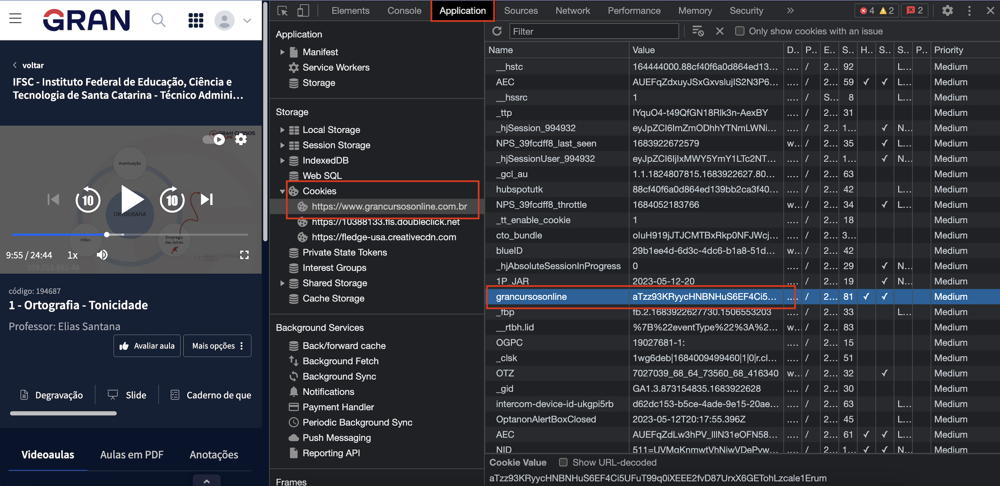

# Automação Grancursos

  Essa aplicação feita em Python faz o download de todos as aulas PDF, slides e degravações de cada aula de todas as matérias de um curso. Todo o conteudo é gerado na pasta "content" e fica separado em pastas com o nome das disciplinas e aulas.

## Variáveis de ambiente

É preciso criar uma cópia do arquivo .env.example, renomea-lo para .env e definir os valores das variáveis CURSO_ID e AUTH_COOKIE_VALUE.

### Cookie de autenticação (AUTH_COOKIE_VALUE)
 Para definir o cookie de autenticação é necessário estar autenticado na sua conta do grancursos. Depois disso basta abrir as ferramentas de desenvolvedor do seu navegador(Control + Shift + I no Windows / Command + Option + I no Mac) e copiar o valor(da coluna value) do cookie "grancursosonline" assim como na imagem abaixo:


### Curso (CURSO_ID)
Para definir o curso que deseja fazer os downloads, basta entrar em qualquer aula desse curso no site do grancursos e copiar o valor do id do curso da url como mostra a imagem:


## Execução

- É necessário ter o python instalado no seu computador.
- No terminal digite: ```pip install -r requirements.txt``` para instalar as dependências
- Para iniciar o programa: ```python script.py``` ou ```py script.py```
